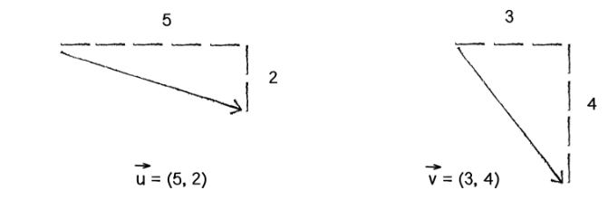
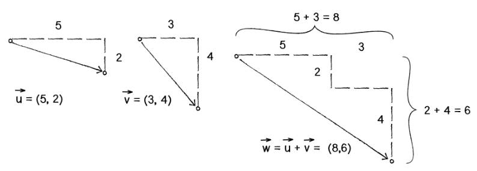

# JavaSsript Vectors: Lab 829#

###Objectives###
 - Create a vector object with properties and methods
 - Understand vector magnitude and direction 
 - Create getters and setters for magnitude and direction 
 - Understand vector addition, subtraction
 - Review a little Trig
 

##Part I: Add a Vector constructor function to your lab ##

 - Get the Student_AdvancedAnimation repo from GitHub 
 - Create a folder for lab829vectors

##Part II: Understand Vectors##

 -  Vectors have **two** values: **Magnitude and Direction**
 

 

 -  Think of the **magnitude** of a vector as the **length of the hypotenuse** of a right triangle.  
 If the x and y properties of your vector object represent the sides of the triangle, what is the magnitude in terms of x and y?  

 -  Think of the **direction** of a vector as the **angle** formed by the hypotenuse and one side of the triangle  
If the x and y properties of your vector object represent the sides of the triangle, what is the direction in terms of x and y?  
 
##Part III: Create Getters and Setters for the Vector Magnitude and Direction ##

 -  Given a vector object, we want to get and set both the magnitude and dorection of the vector.  For instance, consider the following code:

		var v1 = new JSVector(100, 200);

		v1.getMagnitude();
		v1.setMagnitude();
		v1.getDirection();
		v1.setDirection();

 - The signatures for these methods are in the lab for lab folder for this project (as shown below).  
 
        // Set the magnitude of the vector,
		// retaining the angle (direction).
		JSVector.prototype.setMagnitude = function(mag){
		  
		}
		
		// Get the magnitude of the vector using pythagorean theorem
		JSVector.prototype.getMagnitude = function(){
		 
		}
		
		// Set the angle (direction) of the vector,
		// retaining the magnitude.
		JSVector.prototype.setDirection = function(angle){
		 
		}
		
		// Get the direction (angle) of the vector
		JSVector.prototype.getDirection = function(){
		  
		}

 - **Work with your partner and discuss the following**.  What do getter methods return?  How do we set values? How can we calculate these values?

##Part IV: Vector Addition and subtraction ##

 - The Sum of two vectors is the sum of their x and y properties:

 - We could simple add the properties directly:  The code below will take the x and y values from one vector and add it to another

			v1.x = v1.x + v2.x;
			v1.y = v1.y + v2.y;

 - Or we can write a method to accomplish this:

			v1.add(v2);

 - Write the code for the **add()** and **sub()** methods in the **JSVector()**class

----

